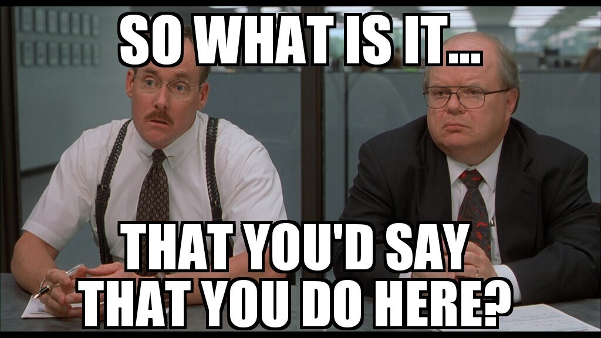
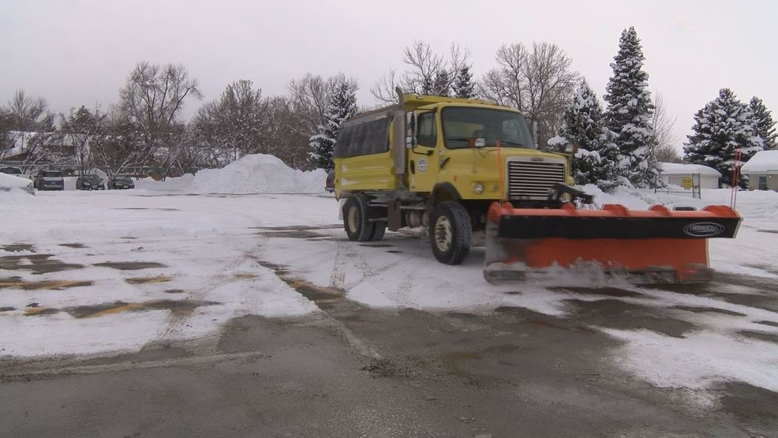
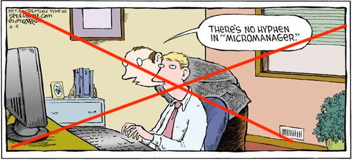
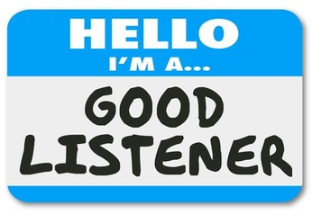
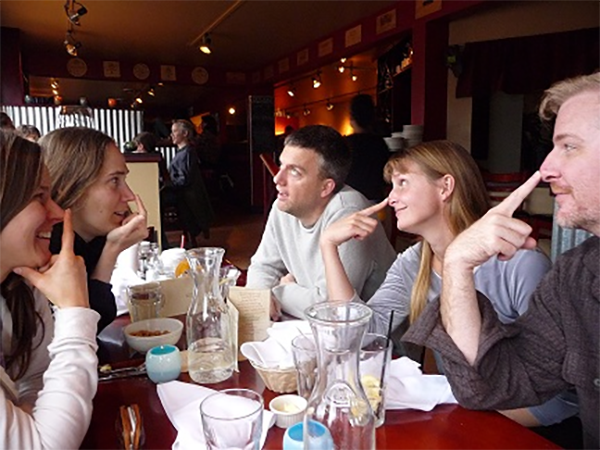
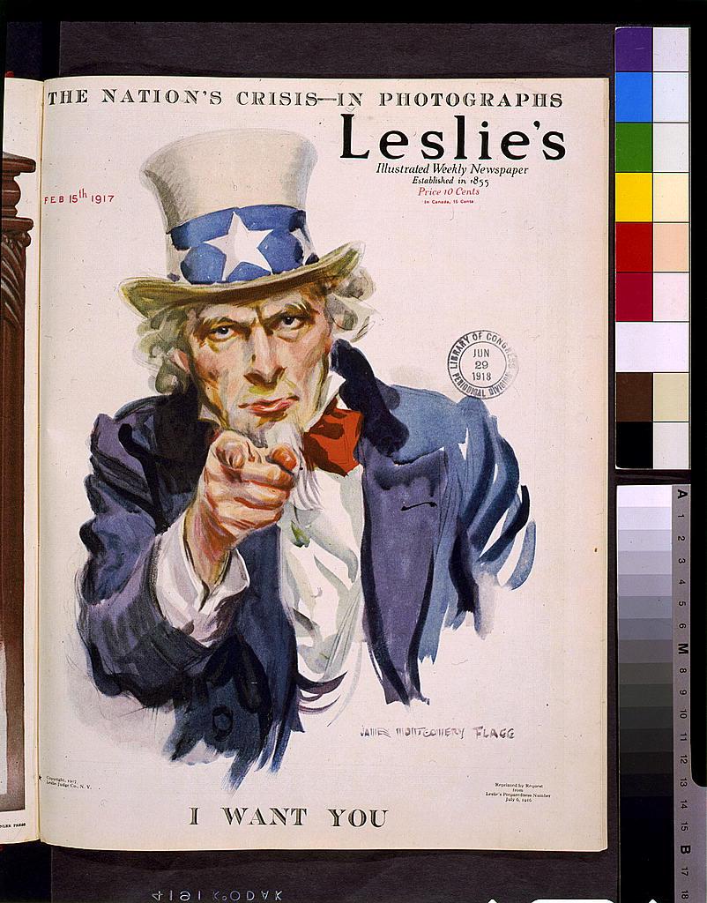

```{r}
library(knitr)
```


## Hoegh: Department Head Vision

```{r, out.width = "100px"}
#| fig-align: center
#| fig-cap: "Link to presentation slides: andyhoegh.github.io/Vision"

```

## About Me

::: {.fragment fragment-index=1}
- 10th year at MSU
- Promoted to Associate Professor in 2022
:::

::: {.fragment fragment-index=2}
- __Scholarship:__
    - Applied Statistician
    - 40+ peer-reviewed papers
    - 13 (8 + 5) grants
:::

::: {.fragment fragment-index=3}
- __Teaching:__
    - 15 different class sections
    - 3 PhD Students, 14 MS Stat Students, 18 MSDS Students
:::


:::{.fragment fragment-index=4}
- __Service__
    - Associate Department Head
    - Department & College RPT Committee
    - Awards Committee
    - Graduate Program Committee
    - Executive Committee / Stat Group Liasion
    - Search Committees (Chair) 
    - Data Science Steering Committee
    - Course Supervisor (STAT 411 & STAT 332)
    - College Research Advisory Committee
:::

## Presentation Overview

1. What does a department head do?
2. What are qualities of a good department head?
3. Why I am I standing up here today?
4. What are my plans?
5. What do I need from you?

# WHAT DOES A DEPARTMENT HEAD DO?

## What does a department head do?

```{r, out.width = "100px"}
#| fig-align: center
#| fig-cap: "Image by Cliff Harris via https://www.positech.co.uk/cliffsblog/2021/12/13/what-exactly-is-it-that-you-do-here/"

```

## What does a department head do?

1. Set department culture and be a face of the department

::: {.fragment fragment-index=1}
2. Deploy teaching expertise (class scheduling)
:::

::: {.fragment fragment-index=2}
3. Conduct annual evaluations
:::

::: {.fragment fragment-index=3}
4. Guide RPT process and mentor candidates
:::

::: {.fragment fragment-index=4}
5. Advocate for the department: hiring & resources
:::

::: {.fragment fragment-index=5}
6. Oversee departmental affairs: orientation events, scholarships, graduation, etc.
:::

::: {.fragment fragment-index=6}
7. Manage budgets 
:::

::: {.fragment fragment-index=7}
8. Maintain scholarship and teaching (50% administrative appointment)
:::

# WHAT ARE QUALITIES OF A GOOD DEPARTMENT HEAD?

## Clear the Path

```{r, out.width = "100%"}
#| fig-align: 'center'
#| fig-cap: "Image from NBC Montana via https://nbcmontana.com/news/local/bozeman-snow-plows-working-around-the-clock"


```

## Enable Good Work and Good Ideas

```{r, out.width = "100px"}
#| fig-align: center
#| fig-cap: "Original Image by Dave Coverly"

```

## Be Fair

```{r, out.width = "100px"}
#| fig-align: center
#| fig-cap: "Image by Jen via  https://afiremanswife.com/2017/08/02/half-a-cake-for-a-half-birthday"
knitr::include_graphics("cake.jpg")
```

## Be a Great Listener and Communicator

```{r, out.width = "100px"}
#| fig-align: center
#| fig-cap: "Image by Farhana Huq via  https://www.surflifecoaching.com/blog/3-steps-to-becoming-a-better-listener"

```


# WHY AM I STANDING UP HERE TODAY?

## Why me?

```{r, out.width = "100px"}
#| fig-align: center
#| fig-cap: "Image by Scott Berkun via  https://scottberkun.com/2010/finger-on-nose-how-to-make-fast-decisions/"

```


# WHAT ARE MY PLANS?

## No ambitious 100 day agenda

::: {.fragment fragment-index=1}
- Maintain culture and department trajectory
:::

::: {.fragment fragment-index=2}
- Gain better understanding of processes within subgroups
:::

::: {.fragment fragment-index=3}
- Be available for conversation
:::

::: {.fragment fragment-index=4}
- Advocate for additional faculty positions
:::

::: {.fragment fragment-index=5}
- Build leadership team
:::


# WHAT DO I NEED FROM YOU?


## Who is next?

```{r, out.width = "100px"}
#| fig-align: center
#| fig-cap: "Image by James Montgomery Flagg via  https://blogs.loc.gov/teachers/2014/07/uncle-sam-american-symbol-american-icon/"

```

## Shared Governance

::: {.fragment fragment-index=1}
- Keep up the good work
:::

::: {.fragment fragment-index=2}
- All good ideas are welcome
:::

::: {.fragment fragment-index=3}
- More involved Executive Committee / Faculty Affairs Committee
:::

::: {.fragment fragment-index=4}
- Associate Department Head
:::

## 

::: {.r-fit-text}
Questions?
:::